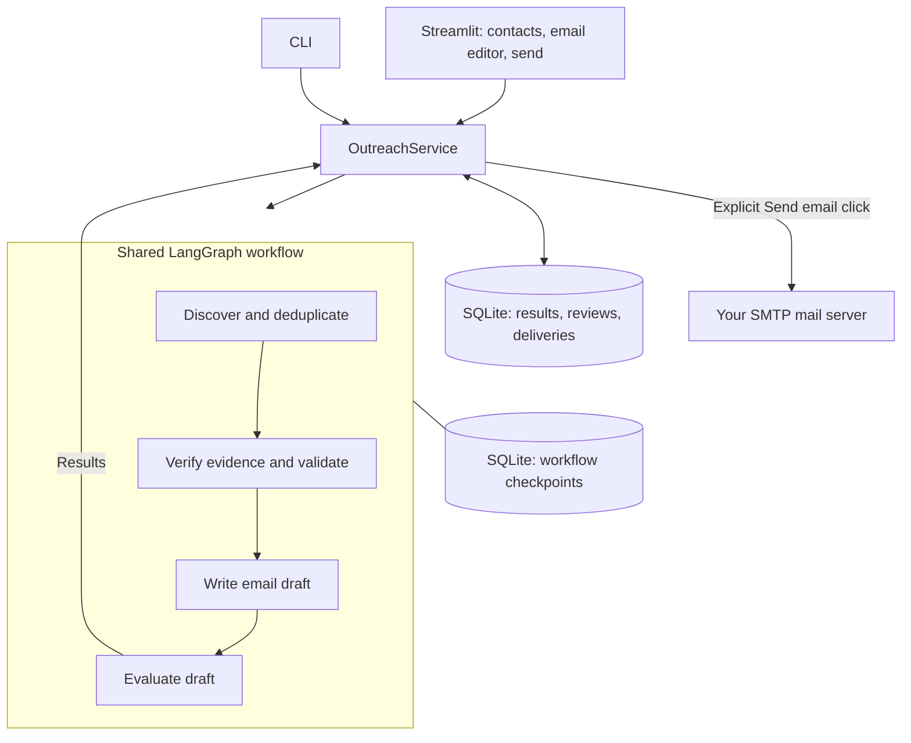

# Outreach

Find notaries for company formation or venture capital investors for your startup, then prepare evidence-based outreach drafts for human review.

Outreach reduces the manual work of finding candidates, checking their websites, and writing a relevant first email. It collects sources, checks suitability, and generates personalized German email drafts in one local app. Emails are sent only when you review the recipient and message and click **Send email**.

| Search | What you provide | What it checks |
| --- | --- | --- |
| Notary | Location, UG or GmbH, result count | Evidence of company-formation services |
| Venture Capital | Geography, startup description, industry, funding stage, result count | Evidence of investment fit |

## Quick start

You need Git, [uv](https://docs.astral.sh/uv/getting-started/installation/), and an API key from Groq, OpenAI, Anthropic, or OpenRouter. The project uses Python 3.13.

```sh
git clone https://github.com/NikrrGit/NotaryOutreach.git
cd NotaryOutreach
uv python install 3.13
uv sync --locked
cp .env.example .env
```

On Windows PowerShell, use `Copy-Item .env.example .env` for the last command.

Open `.env`, choose a provider, and set its key. For example:

```dotenv
LLM_PROVIDER=openai
OPENAI_API_KEY=your_openai_api_key
```

Start the app from the project directory:

```sh
uv run streamlit run src/ui/app.py --server.address 127.0.0.1
```

Open the local URL printed in the terminal (usually <http://localhost:8501>). Press `Ctrl+C` to stop. The app creates the database files automatically; no database server or manual migration command is needed.

## Choose your provider

Set `LLM_PROVIDER` and its matching API key in `.env`; no code changes are needed.

| `LLM_PROVIDER` | Key | Default generation model | Default live search model |
| --- | --- | --- | --- |
| `groq` (default) | `GROQ_API_KEY` | `openai/gpt-oss-20b` | `openai/gpt-oss-120b` |
| `openai` | `OPENAI_API_KEY` | `gpt-4.1-mini` | `gpt-4.1-mini` |
| `anthropic` | `ANTHROPIC_API_KEY` | `claude-sonnet-4-6` | `claude-sonnet-4-6` |
| `openrouter` | `OPENROUTER_API_KEY` | `openai/gpt-4.1-mini` | Same as generation |

For Anthropic, for example:

```dotenv
LLM_PROVIDER=anthropic
ANTHROPIC_API_KEY=your_anthropic_api_key
```

Groq discovery uses [browser search](https://console.groq.com/docs/tool-use/built-in-tools/browser-search). The retired `groq/compound` model is no longer the default; remove any old `SEARCH_MODEL=groq/compound` override. Existing Groq API keys still work with supported models. Set `LLM_MODEL` to override generation and `SEARCH_MODEL` to override discovery. Groq, OpenAI, and Anthropic search models must support their provider's native web-search tool. Your account must have model access. There is no automatic fallback to another provider. Restart the app after changing settings.

OpenAI and Anthropic discovery use [OpenAI web search](https://developers.openai.com/api/docs/guides/tools-web-search) and [Anthropic web search](https://platform.claude.com/docs/en/agents-and-tools/tool-use/web-search-tool), followed by a separate call to format the research as JSON. Web-search charges and token usage apply.

### OpenRouter: one key for the full workflow

Set these values in `.env`, replacing any previous provider and model settings:

```dotenv
LLM_PROVIDER=openrouter
OPENROUTER_API_KEY=your_openrouter_api_key
LLM_MODEL=openai/gpt-4.1-mini
SEARCH_PROVIDER=openrouter
SEARCH_MODEL=
```

Restart the app and click **Retry search**. One OpenRouter key handles discovery, verification, drafting, and evaluation for both Notary and VC searches. No separate OpenAI or Exa key is needed. `LLM_BASE_URL` and `LLM_API_KEY` are only used by the generic compatible provider.

Discovery uses OpenRouter's [web-search plugin](https://openrouter.ai/docs/guides/features/plugins/web-search) with the Exa engine and up to 10 search results. It requires returned source citations before formatting contacts. Search and model usage consume OpenRouter credits, including when using a free model; check your balance and key spending limit if a request fails with a credits error.

Use an OpenRouter model ID such as `openai/gpt-4.1-mini` in `LLM_MODEL`. Discovery uses that model unless `SEARCH_MODEL` is set. Omit the `:online` suffix: the app enables search for discovery itself. Models must follow JSON instructions; responses are validated locally.

### Other OpenAI-compatible endpoints

Use a Chat Completions-compatible endpoint for verification, drafting, and evaluation. It must follow JSON instructions; the app validates responses locally. Set a native search provider separately because a generic chat endpoint does not supply live web research:

```dotenv
LLM_PROVIDER=openai_compatible
LLM_BASE_URL=https://your-provider.example/v1
LLM_API_KEY=your_endpoint_api_key
LLM_MODEL=your_model_id
SEARCH_PROVIDER=openai
OPENAI_API_KEY=your_openai_api_key
```

Replace the endpoint and model with your provider's values. Local servers can use an HTTP URL and a nonempty placeholder key if they do not require authentication. This supports compatible APIs, not arbitrary SDKs. `SEARCH_PROVIDER` can be `groq`, `openai`, `anthropic`, or `openrouter`; provide that provider's key too.

## Run your first search

1. Choose **Notary** or **Venture Capital** in the sidebar and start a search.
2. Browse the contacts table and select **Open contact** to see details and sources.
3. Edit the email beside the contact. A plain default template appears if no AI draft is available.
4. Check the recipient, facts, and signature. Tick **I reviewed this recipient and message**, then click **Send email**.

Failed searches show the error directly and offer **Retry search**, which creates a fresh job. Previous searches remain available. Editing saves a new draft version; saved reviews stay attached to their original version. AI evaluation and approval are available under **Quality checks and review history**. Sending is a separate, explicit human decision and does not require an AI passing score.

## Send from the app

Add your mail provider's SMTP settings to `.env`. Search and editing work without them; direct sending requires them.

```dotenv
SMTP_HOST=smtp.your-provider.example
SMTP_PORT=587
SMTP_SECURITY=starttls
SMTP_FROM=you@example.com
SMTP_USERNAME=you@example.com
SMTP_PASSWORD=your_app_password
```

Use the host and credentials supplied by your email provider. For implicit TLS, use `SMTP_SECURITY=ssl` and `SMTP_PORT=465`. Keep credentials in `.env`; some providers require an app password. Username and password may both be blank for servers that allow authenticated network relaying. Plain unencrypted SMTP is not supported.

The app sends one message per click, saves the exact draft and recipient, and records the result in SQLite. A successful send means the SMTP server accepted the message, not guaranteed inbox delivery. Refreshing cannot resend the same draft. If a connection fails during submission, the app marks delivery as uncertain and blocks resending that version; check your mail provider before creating another copy. No bulk sends or automatic follow-ups run.

## How it works

Both search modes use the same service and four agents. The selected target changes the research and verification criteria.



The service saves jobs, candidates, verifications, drafts, evaluations, reviews, and delivery records. Existing databases upgrade automatically while preserving saved reviews. Checkpoints track workflow progress for recovery. Verification uses website evidence; missing or inconclusive evidence stays unknown.

## Command line

Run these commands from the project directory. Searches create and execute a saved job.

```sh
uv run outreach search --type notary --location Berlin --company-type UG --limit 10

uv run outreach search --type vc --location Germany --description "Security software for SMEs" --industry Cybersecurity --stage Seed --limit 10

uv run outreach jobs
```

Replace `JOB_ID` below with the ID printed when a search starts or returned by `jobs`:

```sh
uv run outreach show JOB_ID
uv run outreach run JOB_ID
uv run outreach resume JOB_ID
```

| Command | Purpose |
| --- | --- |
| `show` | Load saved results |
| `run` | Start a saved job that has no checkpoint |
| `resume` | Continue an interrupted workflow, or reload a completed one |

Commands return JSON on stdout and diagnostics on stderr. `notaryoutreach` is an alias for `outreach`. Use `uv run outreach --help` for options; edit and review drafts in Streamlit.

## Configuration and local data

| Setting | Default | Purpose |
| --- | --- | --- |
| `LLM_PROVIDER` | `groq` | Provider for verification, drafting, and evaluation |
| Provider API key | None | Use the matching key above; saved results can be browsed without it |
| `LLM_MODEL` | Provider default | Generation model override |
| `SEARCH_PROVIDER` | Same as `LLM_PROVIDER` | Provider for discovery, including OpenRouter |
| `SEARCH_MODEL` | Search provider default | Live search model override |
| `LLM_BASE_URL`, `LLM_API_KEY` | None | Custom endpoint URL and key; used only for `openai_compatible` |
| `DATABASE_PATH` | `data/outreach.db` | Application results and review history |
| `CHECKPOINT_PATH` | `runs/checkpoints.sqlite3` | Workflow progress and recovery |

Environment variables override `.env`. CLI flags `--env-file`, `--database`, and `--checkpoint-path` select another configuration file or override database paths. Relative paths are resolved from the current working directory.

Results are stored locally, but agent calls send search details, startup descriptions, and relevant content to your selected generation and search providers. Research also accesses external websites. Internet access and provider usage limits apply. `.env` and local databases are excluded from Git; keep credentials private.

**Backups:** Stop the app before copying both databases and any SQLite sidecar files. Restore both together. Preserve the application database's original absolute path when restoring resumable jobs: checkpoint identities include that path.

## Recovery and limitations

- **Interrupted search:** Select **Resume search** in Streamlit when available, or use `outreach resume JOB_ID`. If no checkpoint exists, use **Start saved search** or `outreach run JOB_ID`.
- **Missing key:** Set the API key matching `LLM_PROVIDER` (and `SEARCH_PROVIDER` if different) in `.env` and restart the app. The configuration check below validates settings; it does not test the key against the provider.
- **Asked for a Groq key when using OpenRouter:** Set `LLM_PROVIDER=openrouter` and `SEARCH_PROVIDER=openrouter`. Adding a key alone does not select a provider. Restart the app, then click **Start saved search** to retry a search that failed before research began.
- **No draft or manual review required:** Inspect the visible errors and evidence. Correct the issue and click **Retry search**. Contacts without AI drafts still offer a default email template.
- **One local user:** Run one application process against the database files. Avoid running CLI workflows alongside Streamlit on the same files. Authentication, background workers, and multi-user hosting are outside this MVP.

Recovery may repeat an interrupted external call; stable record IDs prevent duplicate persisted results. The requested result count is a discovery target, not a guarantee of eligible candidates or drafts. Contacts and model assessments need human review, confidence scores are not calibrated probabilities, and Notary searches do not enforce an exact distance radius.

## Development checks

```sh
uv run python -m notaryoutreach.config --require-api-key
uv run python -m unittest discover -s tests
```

Configuration validation makes no external connection. Tests use temporary databases and mocked providers to cover both workflows, failures, recovery, persistence, and review preservation; they do not verify live provider availability or research quality.

Provider changes apply to new calls, including resumed jobs and re-evaluation; existing saved results remain unchanged.

The main code lives in `src/providers/`, `src/agents/`, `src/graph/`, `src/services/`, `src/storage/`, and `src/ui/`. SQLite migrations are packaged in `src/db/migrations/`.

## License

[MIT](LICENSE)
