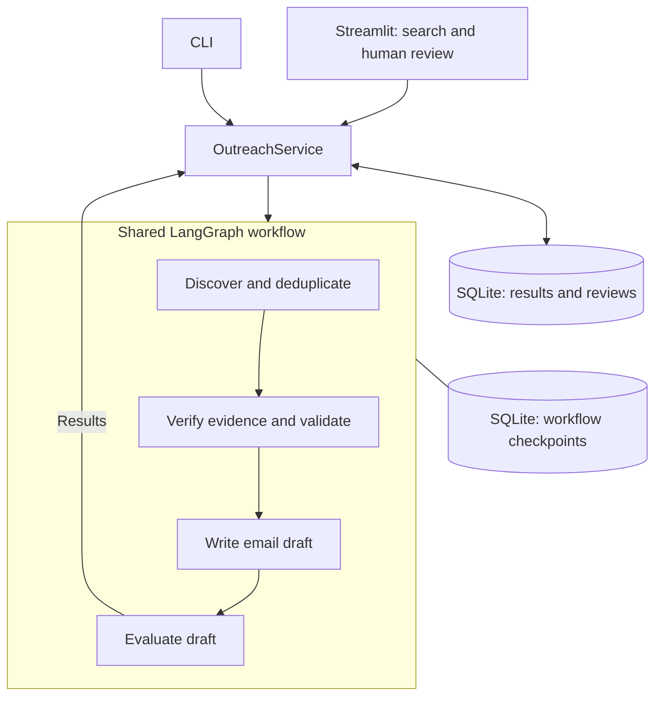

# Outreach

Find notaries for company formation or venture capital investors for your startup, then prepare evidence-based outreach drafts for human review.

Outreach reduces the manual work of finding candidates, checking their websites, and writing a relevant first email. It collects sources, checks suitability, and generates personalized German email drafts in one local app. **It never sends emails.**

| Search | What you provide | What it checks |
| --- | --- | --- |
| Notary | Location, UG or GmbH, result count | Evidence of company-formation services |
| Venture Capital | Geography, startup description, industry, funding stage, result count | Evidence of investment fit |

## Quick start

You need Git, [uv](https://docs.astral.sh/uv/getting-started/installation/), and a [Groq API key](https://console.groq.com/keys). The project uses Python 3.13.

```sh
git clone https://github.com/NikrrGit/NotaryOutreach.git
cd NotaryOutreach
uv python install 3.13
uv sync --locked
cp .env.example .env
```

On Windows PowerShell, use `Copy-Item .env.example .env` for the last command.

Open `.env` and set your key:

```dotenv
GROQ_API_KEY=your_groq_api_key
```

Start the app from the project directory:

```sh
uv run streamlit run src/ui/app.py --server.address 127.0.0.1
```

Open the local URL printed in the terminal (usually <http://localhost:8501>). Press `Ctrl+C` to stop. The app creates the database files automatically; no database server or manual migration command is needed.

## Run your first search

1. Choose **Notary** or **Venture Capital** and enter the search criteria.
2. Select **Start search**, or **Save search** to run it later.
3. Open a candidate and inspect the evidence, sources, draft, and evaluation.
4. Edit and evaluate the draft, then approve or reject it. Approval requires a passing evaluation.

Edits create a new draft version that needs fresh evaluation and approval. Previous versions and review decisions are retained. Approval records your decision locally; copy the reviewed draft into your email client when you are ready to contact someone.

## How it works

Both search modes use the same service and four agents. The selected target changes the research and verification criteria.



The service saves jobs, candidates, verifications, drafts, evaluations, and reviews. Checkpoints track workflow progress for recovery. Verification uses website evidence; missing or inconclusive evidence stays unknown.

## Command line

Run these commands from the project directory. Searches create and execute a saved job.

```sh
uv run outreach search --type notary --location Berlin --company-type UG --limit 10

uv run outreach search --type vc --location Germany --description "Security software for SMEs" --industry Cybersecurity --stage Seed --limit 10

uv run outreach jobs
```

Replace `JOB_ID` below with the ID printed when a search starts or returned by `jobs`:

```sh
uv run outreach show JOB_ID
uv run outreach run JOB_ID
uv run outreach resume JOB_ID
```

| Command | Purpose |
| --- | --- |
| `show` | Load saved results |
| `run` | Start a saved job that has no checkpoint |
| `resume` | Continue an interrupted workflow, or reload a completed one |

Commands return JSON on stdout and diagnostics on stderr. `notaryoutreach` is an alias for `outreach`. Use `uv run outreach --help` for options; edit and review drafts in Streamlit.

## Configuration and local data

| Setting | Default | Purpose |
| --- | --- | --- |
| `GROQ_API_KEY` | None | Required for research, generation, and re-evaluation; saved results can be browsed without it |
| `DATABASE_PATH` | `data/outreach.db` | Application results and review history |
| `CHECKPOINT_PATH` | `runs/checkpoints.sqlite3` | Workflow progress and recovery |

Environment variables override `.env`. CLI flags `--env-file`, `--database`, and `--checkpoint-path` select another configuration file or override database paths. Relative paths are resolved from the current working directory.

Results are stored locally, but agent calls send search details, startup descriptions, and relevant content to Groq. Research also accesses external websites. Internet access and Groq usage limits apply. `.env` and local databases are excluded from Git; keep credentials private.

**Backups:** Stop the app before copying both databases and any SQLite sidecar files. Restore both together. Preserve the application database's original absolute path when restoring resumable jobs: checkpoint identities include that path.

## Recovery and limitations

- **Interrupted search:** Select **Resume search** in Streamlit when available, or use `outreach resume JOB_ID`. If no checkpoint exists, use **Start saved search** or `outreach run JOB_ID`.
- **Missing key:** Set `GROQ_API_KEY` in `.env` and restart the app. The configuration check below validates settings; it does not test the key against Groq.
- **No draft or manual review required:** Inspect the recorded errors and evidence. A completed `manual_review` job does not restart through resume; correct the input or external issue and create a new search if needed.
- **One local user:** Run one application process against the database files. Avoid running CLI workflows alongside Streamlit on the same files. Authentication, background workers, and multi-user hosting are outside this MVP.

Recovery may repeat an interrupted external call; stable record IDs prevent duplicate persisted results. The requested result count is a discovery target, not a guarantee of eligible candidates or drafts. Contacts and model assessments need human review, confidence scores are not calibrated probabilities, and Notary searches do not enforce an exact distance radius.

## Development checks

```sh
uv run python -m notaryoutreach.config --require-api-key
uv run python -m unittest discover -s tests
```

Configuration validation makes no external connection. Tests use temporary databases and mocked providers to cover both workflows, failures, recovery, persistence, and review preservation; they do not verify live provider availability or research quality.

The main code lives in `src/agents/`, `src/graph/`, `src/services/`, `src/storage/`, and `src/ui/`. The initial schema is packaged in `src/db/migrations/001_initial.sql`.

## License

[MIT](LICENSE)
